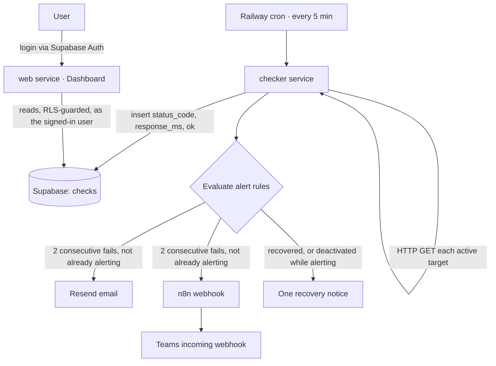

# WorkWright Shop Monitor — Spec

> **Repo:** `workwrightutah/ops-monitor` · **Domain:** `status.workwright.co`
> Translation of `SOW_Benson.pdf` into the repository's single source of truth. Kept true to what
> shipped — where the build diverged from the original plan, this file records what was actually
> built and `docs/decisions.md` records why.

## The one sentence

A small, team-only web app that checks WorkWright's live sites every five minutes, records uptime
and response time, and raises one alert (email + Teams) when a site goes down and one notice when
it comes back.

## Stack & coordinates

| Piece | Choice | Status |
|---|---|---|
| Repo | `workwrightutah/ops-monitor` | ✅ |
| Live domain | `https://status.workwright.co` (CNAME in Cloudflare) | ⏳ pending DNS |
| Data layer | Supabase `mgzhjwboinevltuwprxv`, schema via migrations, RLS on | ✅ |
| Auth | Supabase Auth, email + password — dashboard is team-only | ✅ |
| Scheduler | **Railway cron** service, `*/5 * * * *` | ✅ |
| Hosting | Railway project `ops-monitor`; services `web` + `checker` | ✅ |
| Email alerts | Resend → `hello@workwright.co` | ⏳ pending domain verification |
| Chat alerts | n8n webhook → Teams incoming webhook | ✅ |
| Outcome flag | Internal (WorkWright-owned) | ✅ |

## Architecture

The checker writes; the dashboard reads. The checker uses the `service_role` key and bypasses RLS;
the dashboard reads as the signed-in user so the team-only policies stay in force. Nothing
client-owned is watched — only WorkWright property.

## Data model

Created via migrations only. RLS enabled on both tables; only authenticated `@workwright.co`
accounts can read.

**`targets`** — the things we watch

| Column | Notes |
|---|---|
| `id` | uuid, surrogate key |
| `name` | Human label; appears on the tile and in alert subjects |
| `url` | What we GET. Constrained to `http(s)://`, unique |
| `active` | Only active targets are checked |
| `alerting` | True between sending an outage alert and its recovery notice. **Owned by the checker — never edit by hand.** Added mid-build; see `docs/decisions.md` |
| `created_at` | timestamptz |

**`checks`** — one row per check, per target

| Column | Notes |
|---|---|
| `id` | bigint identity |
| `target_id` | References `targets`, cascade delete |
| `checked_at` | When the check ran |
| `status_code` | HTTP status, or **NULL** when no HTTP response arrived (DNS failure, refused, timeout) |
| `response_ms` | Response time in ms, recorded on failures too |
| `ok` | `true` on 2xx/3xx; `false` otherwise |

**`target_status`** — a view, not a table. One row per target with its latest check and 24h/7d
uptime, so a dashboard tile is one query rather than four. Declared `security_invoker = on` so RLS
still applies to the caller.

### Deviations from the original spec

- **`targets.alerting` was added.** The original plan derived alert state from the tail of
  `checks`. That cannot satisfy "deactivating produces exactly one recovery notice," because
  deactivating stops the check rows that recovery keys off. One boolean fixes it.
- **No `org_id`**, against the house default. Single-tenant internal tool; the spec caps the
  columns. Logged as a deliberate exception.

## Alert behavior (the core contract)

- A check **fails** when `ok = false`.
- **Fire an alert** on **two consecutive failed checks** when not already alerting. The alert is a
  Resend email to `hello@workwright.co` **and** a post to the n8n webhook, which posts an Adaptive
  Card to Teams.
- **No repeat alerts** while a target stays down. One outage → one alert.
- **One recovery notice** when the target responds again, or when a target is **deactivated while
  alerting** — otherwise the last thing anyone heard about it is "down."
- Recovery notices only fire for targets that actually alerted.
- The `alerting` flag is set **only after a notice is delivered**, so a total delivery failure
  leaves the alert open and the next run retries rather than marking an outage announced that
  nobody heard.

Encoded as a pure function in `src/checker/alert-rules.ts` with 12 tests (`npm test`), including
the full outage lifecycle.

## Seed targets

- `workwright.co` — **inactive**; the domain has no web server yet.
- The ops-monitor itself — **active**, currently pointed at the Railway domain; repoint to
  `status.workwright.co` once the CNAME resolves.
- One deliberately broken 404 route — **inactive** except when testing alerts.

## Out of scope

SMS alerts · public/client-facing status pages · multi-role permissions · data retention beyond
30 days · Sentry integration (month 2) · monitoring anything client-owned.

## Acceptance criteria — definition of done

- [x] **Auth gate.** Dashboard requires login; a non-team account cannot see data.
      *Verified three ways: (1) at the REST API — team sees 3 targets, non-team and anonymous see
      `[]`, writes rejected `42501`; (2) through the `target_status` view, confirming
      `security_invoker` holds; (3) in the deployed app — a signed-in non-team account gets HTTP
      200, zero target data in the HTML, and a plain-language explanation.*
- [x] **Alert path.** Two consecutive failures produce one email and one Teams message;
      deactivating produces exactly one recovery notice. *Verified end to end on both channels:
      silent on failure 1, one alert on failure 2 (email + Teams), silent on failure 3, one
      recovery on deactivation, silent after. Email confirmed **delivered** in Resend's sent list —
      not merely accepted, which is a distinction that already caught us out once. Caveat: mail
      currently goes to `benson@workwright.co` because `hello@workwright.co` does not exist as a
      mailbox; see `docs/decisions.md`.*
- [ ] **Live data renders.** 24h and 7d uptime and the response-time chart render with real data
      after 24 hours of checks. *Wall clock. Recording started 2026-08-06 23:50 UTC; cadence
      verified across three consecutive cron runs. Uptime and tiles already render correctly with
      partial data.*
- [~] **Live + secure.** Reachable with valid SSL. *Live with a valid cert on the Railway domain.
      `status.workwright.co` DNS is correct and public; awaiting Railway certificate issuance.*
- [x] **Honest history.** `git log` shows incremental commits, not one giant push.
- [~] **Runbook works.** README covers adding a target, alert behavior, and redeploying.
      *Written, but the criterion is that **Ryan** adds a target using only the README. That
      cannot be self-certified.*
- [ ] **Hours reviewed.** Actual vs. the 8–10 budget, reviewed at handoff. *No hours logged in
      Teams Shifts yet — the one criterion no amount of building moves.*

### Known open items at time of writing

- Supabase Auth still uses the built-in test mailer; point SMTP at Resend once the domain verifies.
- Supabase leaked-password protection is disabled (security advisor warning).
- QA accounts `qa-team@workwright.co` and `qa-outsider@notwork.test` exist with known passwords,
  created to prove the RLS gate. Delete before handoff.
- Rotate the `service_role` and Resend keys at handoff.
- The self-monitoring target points at the Railway domain; repoint to `status.workwright.co` once
  its certificate issues. Same service, so history carries over.
